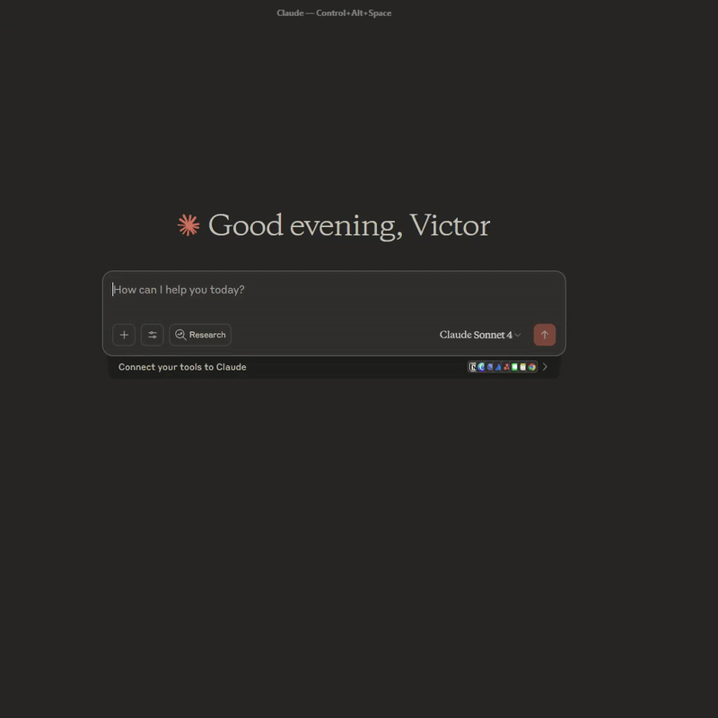

# Summoner Insights


> **AI-Powered League of Legends Performance Analysis & Coaching**

Transform your League of Legends gameplay with personalized AI coaching! Summoner Insights automatically collects match data from the Riot API and provides Claude with detailed performance analytics for personalized improvement recommendations.

## Demo


## 🚀 Features

- **📊 Comprehensive Match Tracking** - Automatically fetch and store your recent match history
- **⏱️ Timeline Analysis** - Minute-by-minute progression tracking (CS, gold, XP, positioning)
- **🎯 Performance Insights** - Win rate trends, champion performance, and farming efficiency
- **💀 Death Pattern Analysis** - Identify positioning mistakes and timing issues
- **🤖 AI Coaching Integration** - Connect with Claude through MCP for personalized coaching
- **📈 Trend Analysis** - Track your improvement over time with detailed statistics

## 🎮 What You Get

### Match Statistics
- KDA, CS, Gold, Vision Score
- Champion performance by win rate
- Game duration and outcome analysis
- Item build tracking

### Timeline Data
- CS progression every minute
- Gold/XP accumulation patterns
- Position heatmaps and movement
- Key event timestamps (kills, deaths, objectives)

### AI Coaching Tools
- **Performance Trends** - Is your gameplay improving?
- **Champion Analysis** - Which champions work best for you?
- **Death Patterns** - Where and when do you die most?
- **Farming Analysis** - CS efficiency and timing breakdowns
- **Timeline Insights** - Minute-by-minute coaching feedback

## 📋 Prerequisites

1. **Riot Games API Key** - Get one from [Riot Developer Portal](https://developer.riotgames.com/)
2. **Python 3.8+** - Required for running the scripts
3. **Claude Desktop** - For AI coaching integration (optional)

## 🛠️ Installation

### Windows (WSL Recommended)

1. **Install WSL** (if not already installed):
   ```powershell
   wsl --install
   ```

2. **Open WSL terminal** and clone the repository:
   ```bash
   git clone https://github.com/vifonne/summoner-insights.git
   cd summoner-insights
   ```

3. **Install Python dependencies**:
   ```bash
   pip install -r requirements.txt
   ```

4. **Set up environment variables**:
   ```bash
   cp .env.example .env
   nano .env  # Edit with your details
   ```

### Linux/macOS

1. **Clone the repository**:
   ```bash
   git clone https://github.com/vifonne/summoner-insights.git
   cd summoner-insights
   ```

2. **Install Python dependencies**:
   ```bash
   pip3 install -r requirements.txt
   ```

3. **Set up environment variables**:
   ```bash
   cp .env.example .env
   nano .env  # Edit with your details
   ```

## ⚙️ Configuration

### Environment Variables

Create a `.env` file with your Riot API credentials:

```env
RIOT_API_KEY=your_riot_api_key_here
RIOT_USERNAME=YourGameName
RIOT_TAGLINE=NA1
```

**Important Notes:**
- `RIOT_USERNAME` is your in-game name (without the #tag)
- `RIOT_TAGLINE` is your region/tag (e.g., NA1, EUW1, etc.)
- Get your API key from [Riot Developer Portal](https://developer.riotgames.com/)

### Supported Regions
- **Americas**: NA1, BR1, LA1, LA2
- **Europe**: EUW1, EUN1, TR1, RU
- **Asia**: KR, JP1

## 🎯 Usage

### 1. Collect Match Data

Run the data collection script to fetch your recent matches:

```bash
python3 summoner_insights.py
```

This will:
- Fetch your last 10 matches from Riot API
- Store match statistics in SQLite database
- Collect timeline data for detailed analysis
- Display a summary of your recent performance

### 2. AI Coaching with Claude (Optional)

Connect the MCP server to Claude Desktop for AI-powered coaching:

#### Step 1: Configure Claude Desktop

**Windows (WSL):**
Open `%APPDATA%\\Claude\\claude_desktop_config.json` and add:

```json
{
  "mcpServers": {
    "summoner-insights": {
      "command": "wsl",
      "args": [
        "-e", "bash", "-c", 
        "cd /path/to/summoner-insights && python3 summoner_insights_mcp.py"
      ]
    }
  }
}
```

**Linux/macOS:**
Open `~/.config/claude-desktop/claude_desktop_config.json` and add:

```json
{
  "mcpServers": {
    "summoner-insights": {
      "command": "python3",
      "args": ["/path/to/summoner-insights/summoner_insights_mcp.py"],
      "cwd": "/path/to/summoner-insights"
    }
  }
}
```

#### Step 2: Restart Claude Desktop

After saving the configuration, restart Claude Desktop to load the MCP server.

#### Step 3: Start Coaching

In Claude Desktop, you can now use these coaching tools:

- `get_recent_matches` - View your match history
- `get_performance_trends` - Analyze your improvement
- `get_champion_performance` - Champion-specific stats
- `analyze_death_patterns` - Positioning analysis
- `get_farming_analysis` - CS efficiency breakdown
- `get_match_timeline` - Detailed match progression

## 🔧 Available Tools

### Data Collection Tools

| Tool | Description |
|------|-------------|
| `summoner_insights.py` | Main data collection script - fetches matches and timeline data |

### AI Coaching Tools (via MCP)

| Tool | Description | Example Use |
|------|-------------|-------------|
| `get_recent_matches` | Basic match history overview | "Show me my recent matches" |
| `get_performance_trends` | Win rate and performance analysis | "Am I improving over time?" |
| `get_champion_performance` | Champion-specific statistics | "How do I perform on Jinx?" |
| `analyze_death_patterns` | Death location and timing analysis | "Where do I die most often?" |
| `get_farming_analysis` | CS progression and efficiency | "How's my farming?" |
| `get_match_timeline` | Detailed match progression | "Show me timeline for match X" |

## 📊 Example Coaching Insights

### Performance Trends
```
📈 Improving
- Recent 5 matches: 60.0% WR
- Previous 5 matches: 20.0% WR
- Champion Pool: 4 unique champions
```

### Death Pattern Analysis
```
💀 Death Pattern Analysis (Last 10 matches)
Total Deaths: 47

Death Timing Distribution:
- Early Game (0-15m): 15 deaths (31.9%)
- Mid Game (15-25m): 20 deaths (42.6%)
- Late Game (25m+): 12 deaths (25.5%)
```

### Farming Analysis
```
🌾 Farming Analysis
- Average CS: 156.3
- Average CS/min: 6.2
- Wins: 168.7 avg CS
- Losses: 151.2 avg CS
- Difference: +17.5 CS in wins
```

## 🗃️ Database Schema

The tool creates a SQLite database with three tables:

- **`matches`** - Basic match statistics (KDA, CS, items, etc.)
- **`timeline_snapshots`** - Minute-by-minute player progression
- **`timeline_events`** - Key events (kills, deaths, objectives, items)

## 🔍 Troubleshooting

### Common Issues

**"Error: 'name'"**
- Make sure you've run `summoner_insights.py` at least once to create the database

**"403 Forbidden"**
- Check your API key is valid and not expired
- Ensure you're using the correct region/tagline

**"No such table: matches"**
- Run `python3 summoner_insights.py` to initialize the database

**MCP Server not connecting**
- Verify the file paths in your Claude Desktop config
- Check that Python dependencies are installed
- Restart Claude Desktop after config changes

### Getting Help

1. Check that your `.env` file is properly configured
2. Verify your Riot API key is active
3. Ensure Python 3.8+ is installed
4. Make sure all dependencies are installed via `pip install -r requirements.txt`

## 📝 License

This project is licensed under the MIT License - see the [LICENSE](LICENSE) file for details.

## 🤝 Contributing

Contributions are welcome! Please feel free to submit a Pull Request.

## ⚠️ Disclaimer

This project is not affiliated with Riot Games. League of Legends is a trademark of Riot Games, Inc.

## 🙏 Acknowledgments

- Riot Games for providing the comprehensive API
- Anthropic for Claude and MCP framework
- The League of Legends community for inspiration

---

**Ready to level up your gameplay? Start your journey to better League performance today!** 🚀